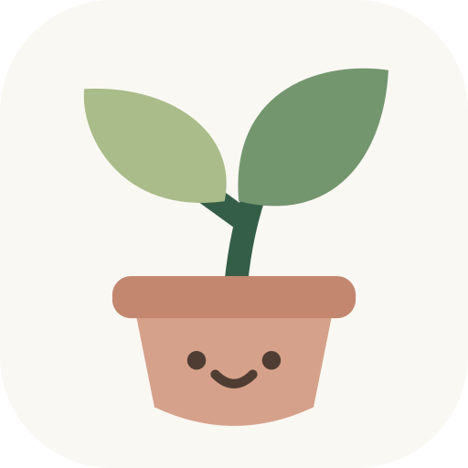
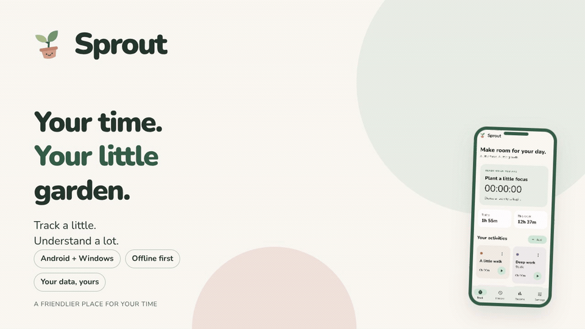

<p align="center"></p>

# Sprout

**Your time. Your little garden.**

A friendly, offline time tracker for **Android and Windows**. Track a little,
understand a lot, and keep your own data. No subscription or hosted backend.



[](https://github.com/bee-san/sprout/actions/workflows/build.yml)
[](LICENSE)

## What grows here

- One-tap activities, descriptions, clients, tags, billable flags, and continuing recent sessions.
- A timer that survives app restarts. Editing its details keeps it running.
- Daily charts, activity donuts, time by tag, daily/session averages, busiest day,
  longest session, local-hour start patterns, and comparisons with the previous period.
- Day, week, month, all-time and custom date ranges, previous/next navigation,
  search, activity and billable filters, and CSV exports.
- **Toggl Track import**, including quoted/multiline descriptions and repeat-import protection.
- Portable JSON backups and safe, additive restore.
- **Android home-screen widgets:** Timer & activities and Weekly stats.
- Windows executable rules, focus/background tracking, optional idle pausing,
  lock/sleep handling, tray controls, close-to-tray, and startup at login.
- SQLite storage and optional Google Drive app-data sync between devices.

## Get Sprout

The [build workflow](https://github.com/bee-san/sprout/actions/workflows/build.yml)
produces `sprout-android` APKs and a `sprout-windows` portable ZIP. Open a
successful run and download its artifacts. Android ARM64 is for modern phones;
the x86_64 APK is for emulators. Windows needs the entire extracted ZIP,
including its DLLs and `data` folder. Run `sprout.exe`.

These are personal preview builds. This repository uses a stable Android signing
key held in encrypted Actions secrets, so its published APKs can update one another.
Forks without signing secrets fall back to a development key; separate clean CI runs
can then use different keys. Back up your history before replacing an installation.
See [Android signing](docs/android-signing.md).

Android requires Android 7 / API 24 or later. Windows targets Windows 10/11 x64 and bundles the Visual C++ runtime DLLs with the portable app. Native Windows
app automation is available only on Windows. Linux and macOS are outside this release.

## Bring your time from Toggl

1. In Toggl Track, open **Reports → Detailed** and select the dates you want.
2. Export a **CSV**, with durations in **Improved / HH:mm:ss** format.
3. In Sprout, open **Settings → Import from Toggl Track** and select the CSV.
4. Review the entry/activity counts, then choose **Import**.

[Toggl's Detailed report guide](https://support.toggl.com/en-us/article/detailed-report-k9bzy2/)
explains report exports. Sprout accepts `Start date`, `Start time` and `Duration`,
or `End date` / `End time` when Duration is absent. Dates must be `YYYY-MM-DD`;
times use `HH:mm[:ss]`. Set your device to the timezone used by your Toggl profile
before importing timestamps without offsets. Explicit `Z` and `±HH:mm` time offsets also work.

Projects become activities, clients stay attached to those activities, descriptions
become session notes, and task names appear at the start of the note. Tags and
billable flags are retained. Blank projects become **Unassigned**. Duration is
authoritative, so source endpoint rounding and DST changes do not change elapsed time.

Every row is checked before anything is written, then the import commits in one
transaction. Existing entries stay intact. Re-importing the same export skips
already imported entries; identical rows within an export are retained individually.
An edited export can produce new entries because Toggl CSV does not contain stable
entry IDs. Use overlapping exports with consistent data and timezone settings.

## Reports that make sense

Reports clip time at your selected period boundaries, including sessions that
cross midnight. Daily averages include empty days and omit future days in an
unfinished period. Previous-period comparisons use the same elapsed calendar
portion and the same filters. Overlapping sessions are preserved and counted;
History flags them so you can correct double tracking. Tags can overlap too.

Daily charts show up to the last 14 days of the selection. Hour charts count
session starts, not time spent at each hour. Filtered CSV export includes the
full matching sessions, while the on-screen report totals are clipped to the
selected dates. CSV cells protect against spreadsheet formula execution.

## Your home-screen garden

On Android, long-press your home screen, choose **Widgets → Sprout**, then add:

- **Timer & activities:** a live timer, Stop button, and the first four activities
  in alphabetical order. Tapping an activity opens Sprout and starts it.
- **Weekly stats:** tracked time today/this week and the weekly session count.
  Its update timestamp shows how fresh the snapshot is.

Widget actions open the app to persist the change. Tracking still uses saved
timestamps when the app is closed; a permanent background service is not required.
Stats refresh when tracking/history changes, during sync, and once a minute while
Sprout is open. Android can redraw widgets periodically from that saved snapshot.

## Build

Use Flutter **3.44.4** and its bundled Dart **3.12.2**. Install Flutter from
https://docs.flutter.dev/install, then:

```sh
flutter pub get
flutter analyze
dart format --output=none --set-exit-if-changed lib test
flutter test
```

Android needs JDK 17, Android SDK 36, and NDK 28.2.13676358:

```sh
flutter build apk --release --split-per-abi --target-platform android-arm64,android-x64
```

Outputs are in `build/app/outputs/flutter-apk/`. For stable signing, follow
[Android signing](docs/android-signing.md).

On Windows, install Visual Studio with **Desktop development with C++**, then:

```powershell
flutter run -d windows
flutter build windows --release
```

Run `build/windows/x64/runner/Release/sprout.exe`. Keep the entire Release folder
in a permanent location before enabling startup. Closing the window leaves the
app in the tray; **Quit** stops the local timer and exits.

## Let your apps start the timer

Add an activity, open **App rules → Link an app**, and select a running process,
browse to an executable, or enter its filename. Choose **While focused** or
**While running**, then enable automatic tracking. A path matches one installation;
a filename matches anywhere. The focused app wins; otherwise the first matching
running-app rule wins. Manual timers take priority. Stopping an automatic timer
pauses automatic tracking until you enable it again.

## Google Drive setup

Tracking works immediately without Google configuration. To enable Drive sync you need your own OAuth clients, created in **one Google Cloud project**, and the same Google account on both devices. No backend or paid Google Cloud service is required for this design.

1. Open https://console.cloud.google.com/ and create/select a project.
2. Enable **Google Drive API**.
3. Configure Google Auth Platform branding and audience. If the app is in Testing, add your account as a test user. Testing refresh tokens can expire; reconnect if requested.
4. Configure the scope `https://www.googleapis.com/auth/drive.appdata`. Sprout requests access only to its own app-data area, not your normal Drive files.

### Windows

Create an OAuth client of type **Desktop app**, download its JSON, then use **Settings → Google setup** to import it. Choose **Connect Google Drive**. Sprout uses the system browser, a loopback callback, a random state value, and PKCE. Credentials and tokens are kept in platform secure storage.

### Android

1. Open **Settings → Google setup** and copy the displayed SHA-1 fingerprint.
2. In the same Google Cloud project, create an **Android** OAuth client using package `dev.beesan.timebud` and that fingerprint.
3. Create a **Web application** OAuth client in the same project. No web redirect is needed for the Android SDK flow.
4. Paste its **client ID** into Google setup on Android and save.
5. Connect Google Drive. Android uses Google's native sign-in and scope-authorization SDK.

If you change an already initialized Android client ID, restart the app first. A build with a different signing key needs its own registered fingerprint. Developers can instead supply the Web client ID using `--dart-define=GOOGLE_ANDROID_SERVER_CLIENT_ID=...`.

### Sync behaviour

- Sync on startup, app resume, a manual request, and every two minutes while the app is running.
- Android does not run a permanent background sync service. The timer is calculated from saved timestamps and keeps its elapsed time when the process is stopped; reopen the app to sync.
- Each installation writes its own JSON journal in Drive's private app-data folder. It never uploads the live database or overwrites another installation's journal.
- Records merge by logical clock and device ID. Repeated downloads are idempotent. Deletion records prevent old copies from bringing deleted sessions back.
- Concurrent edits to the same record use a deterministic winner. Separately recorded sessions remain separate. Overlapping sessions are flagged and included in totals until you correct them.
- The device ID is stored in the local database. Do not clone a database between installations that will run simultaneously.
- Journals retain deleted-record markers and grow with history; compaction is not implemented in this first version.
- There is no instant global timer lock. Offline devices can both record time; those sessions are retained on sync.

## Backups and privacy

Use **Settings → Save a portable backup** for a JSON snapshot of activities and
sessions. Restore adds missing records and keeps existing ones; timers in a backup
restore as finished sessions. Backups exclude Google credentials, local executable
rules and sync tombstones. Use Drive sync for deletion propagation between live
devices, and keep your backup somewhere safe.

No advertising, analytics SDK, screenshots, keystroke recording or Sprout server.
Windows reads foreground/process executable identities for app rules. A matched
executable is stored with the session and can sync to your own Drive app-data area.
Tokens stay in platform secure storage, outside the database and exports.

The internal Android package, database filename and Drive journal prefix retain
`timebud` for compatibility with the original preview. The visible app is Sprout.

## Validation

See [the review](docs/review.md) and [validation evidence](docs/validation.md).
Automated checks cover persistence, imports, report boundaries, sync conflicts,
deletions, retries, and phone/desktop layouts. Public screenshots use synthetic
data. Live Google sign-in needs your OAuth clients; the protocol tests use a local
Drive simulator. Windows runtime checks require a Windows machine.

## Credits

Reports and Android widgets are inspired by
[SimpleTimeTracker](https://github.com/Razeeman/Android-SimpleTimeTracker).
Sprout's shared interface and implementations are built for this Flutter app.
The README GIF is composed and rendered with
[Hyperframes](https://hyperframes.heygen.com/); its source and instructions are in
[docs/promo](docs/promo/README.md). Nunito is bundled under the SIL Open Font License.

Sprout's application code is [MIT licensed](LICENSE).
