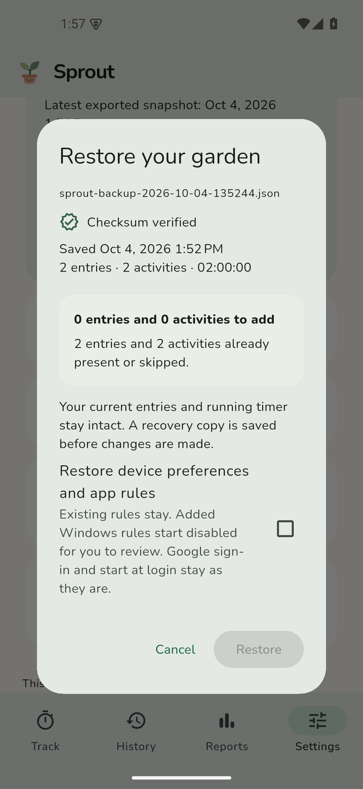

# Keep your garden safe

## Save a portable copy

Open **Settings → Save a portable backup**. Choose a location you can access
outside Sprout, ideally on another device or in your own cloud storage.
Wait for **Backup saved and verified**. Cancelling the picker does not mark a
backup as saved. Settings shows the date of the newest snapshot you have exported;
exporting an older recovery copy does not make that date look newer.

The JSON contains activities, history, descriptions, clients, tags, billable
flags, original device attribution, preferences and Windows app rules. It excludes
Google secrets/tokens, sync journals, installation identity and start at login.
It is readable, so keep it somewhere private. A checksum detects accidental damage;
it does not authenticate a file's author or encrypt its contents.

Manual timers are frozen at the snapshot time without changing the running timer
in the app. Automatic timers use their last recorded heartbeat. Neither restarts
unattended after restore. Names and colours for deleted activities that still have
history are included so a fresh installation can show that history meaningfully.

## Restore saved time

1. Open **Settings → Restore a backup** and select the JSON.
2. Review its saved date, entry count and total time. Sprout shows the records it
   can add and how many current edits it will keep.
3. Leave the optional checkboxes off for a normal additive restore. Choose
   **Recover intentionally deleted records** only when you want those deletions
   undone, including on synced devices. Preferences and app rules are a separate
   option; missing rules start disabled and existing rules stay intact.
4. Choose **Restore**. Sprout first verifies a recovery copy of your current
   database, then applies the additions in one transaction. A failed safety copy
   or database write leaves your existing records unchanged.

Repeating a restore does not duplicate history. Current entries with the same ID
always win, even if they were edited while the preview was open or changed by sync.
Default restore keeps the current timer. Restoring device preferences can change
automatic-tracking behavior. Session IDs and original device labels are retained;
the receiving installation keeps its own sync identity.

Backups from 0.2.0 are accepted after record validation. They have no checksum and
omit preferences and app rules. Missing deleted activity names from those older
files are represented as **Recovered activity**, retaining all their time.
Invalid JSON, duplicate IDs, impossible dates, unfinished sessions, invalid fields
and newer unsupported formats are rejected before any database write. Schema 2
also requires every session/rule to refer to an included activity. Files are
limited to 32 MB and each record list to 100,000 items.

## Local recovery copies

**Settings → Recovery copies** lets you inspect, restore or export saved copies.
Sprout retains one newest snapshot from each of seven saved UTC dates, plus the
eight most recent copies from before imports, restores and deletions. A damaged
copy is marked unavailable; it is kept for inspection and does not displace verified
copies. Pruning happens only after a new copy has been saved and checked.

Copies refresh on startup, after local changes (debounced and limited to about once
a minute), every five minutes while Sprout is open, on Android pause and on normal
Windows quit. A stopped, unchanged garden does not create redundant periodic copies.
No permanent Android background service is required. Tracking remains available
if an automatic copy fails; the visible backup status explains the failure.

Copies live in `backups/` next to the active SQLite database. Android uses the app's
private files directory. Windows normally uses `%APPDATA%/dev.beesan/Sprout/`;
an upgraded Timebud installation retains its original database directory.
Local recovery copies are removed with app data. They cannot protect against
uninstalling, clearing storage or losing the device. Export portable copies too.

## When Sprout cannot open its database

The recovery screen offers **Try again**, **Choose a backup**, and verified local
copies. You can export a local copy before proceeding. Recovery restores only the
time contained in the selected snapshot.

Sprout creates a separate replacement database, restores finished entries and
checks SQLite integrity before changing the original. The old database and its
WAL/SHM companions are kept together in a `recovery-original-…/` directory beside
it. Failure before installation leaves the original in place; failed file moves
are rolled back. Originals are never automatically pruned. The recovered app has
a fresh sync installation identity, while saved sessions retain their original
device attribution. Preferences/rules can be restored later from Settings.

Drive synchronization and portable backup serve different purposes. Sync
propagates current edits and deletions; it does not preserve an old version you can
always return to. If restoring deliberately deleted history after reinstalling,
sync first so Sprout sees the deletion records, then explicitly recover them from
your backup. Real Google sign-in still requires your own OAuth setup.
